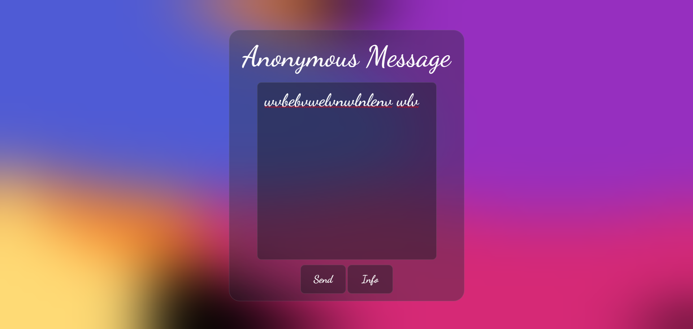

# Anonymous Message App

A secure and anonymous messaging platform built using HTML, CSS, and JavaScript.

## [View Live](https://send-msg-to-pathan.netlify.app/)

## Overview

This project is an anonymous messaging application that allows users to send and receive messages without revealing their identities. The app ensures end-to-end encryption and provides a safe space for users to share their thoughts and opinions.

## Features

- End-to-end encryption for secure messaging
- Anonymous messaging with no user registration or login required
- Real-time messaging with instant delivery
- User-friendly interface for easy message composition and sending

## Screenshot

## Technical Details

- **HTML**: Used for structuring the app layout and UI components.
- **CSS**: Used for styling the app interface and providing a responsive design.
- **JavaScript**: Used for implementing the app logic, encryption, and real-time messaging functionality.

## License

This project is licensed under the MIT License. See `LICENSE` for details.

## Contributing

Contributions are welcome! If you'd like to contribute to this project, please fork the repository and submit a pull request.

## Acknowledgments

- Font: Dancing Script, courtesy of Google Fonts
- Icons: Font Awesome
- Logo: 
   
